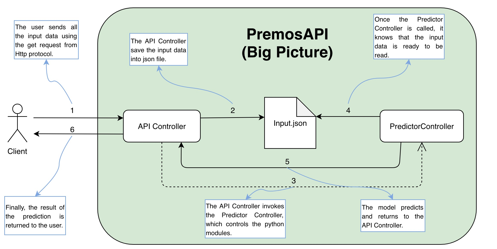

# PremosAPI

## Description

Premos API stands for PREdiction MOdelS. It's part of the course completion project in Computer Engineering by Universidade Federal do Rio Grande

## The Big Picture

 

## How to use the PremosAPI
- The input data is represented as json file. One example of input is shown below:

```
{
  "metadata": {
    "algorithm": "adaboost"
  },
  "input": {
    "g08": "Feminino",
    "hiv": "Reagente",
    "m10": "Nao",
    "m11": "Nao",
    "e36": "Nao",
    "d17": "Nao bebe ha 6 meses",
    "d20": "Nao",
    "count_drogas": "5",
    "d42": "Nao",
    "d45": "Sim",
    "l2": "Nao",
    "F2_dic": "Nao",
    "f16": "Sim",
    "f21": "Sim",
    "P1_dic": "Nao",
    "p11_a": "Nao",
    "P13_14A": "Sim",
    "G10_cor_pele": "Branco",
    "G12_conjugal": "Casado",
    "E1_escolaridade": "Ens.Fundamental",
    "E10_emprego": "Nao trabalha",
    "M_doencas": "Nenhuma",
    "F8ABC": "1 destes é dependente",
    "F9ABC": "Conta com 3",
    "g09_idade": "36",
    "d11": "13",
    "F40_dic": "Sim",
    "d03": "26",
    "D8_9": "Nenhum",
    "porc_vida_doente": "0.277778",
    "D25B_div_idade": "0",
    "D27B_div_idade": "0.0277778",
    "D28B_div_idade": "0.222222",
    "D57_div_idade": "0.666667",
    "CTQ_PN_dic1": "Grave",
    "CTQ_PA_dic1": "Grave",
    "CTQ_EN_dic1": "Leve",
    "CTQ_EA_dic1": "Grave",
    "CTQ_SA_dic1": "Leve",
    "abuso_sexual_vida": "Sim",
    "abuso_sexual_infancia": "Sim",
    "abuso_sexual_crack": "Antes do crack",
    "abuso_fisico_vida": "Sim",
    "abuso_fisico_infancia": "Sim",
    "scid_f_tept": "Ausente",
    "scid_f_tco": "Ausente",
    "scid_psicoticos_dic": "Ausente",
    "scid_depressao_dic": "Presente",
    "scid_bipolar_dic": "Ausente",
    "scid_alcool_dic": "Ausente",
    "scid_alimentar_dic": "Ausente",
    "scid_ansiedade_outros_dic": "Presente",
    "ctq_pos_sum": "15"
  }
}
```

- The result of the classification for the input data is:
```
{
    "class": "Nao"
}
```

The API returns if the drug user in question has already attempted to commit suicide or not.
